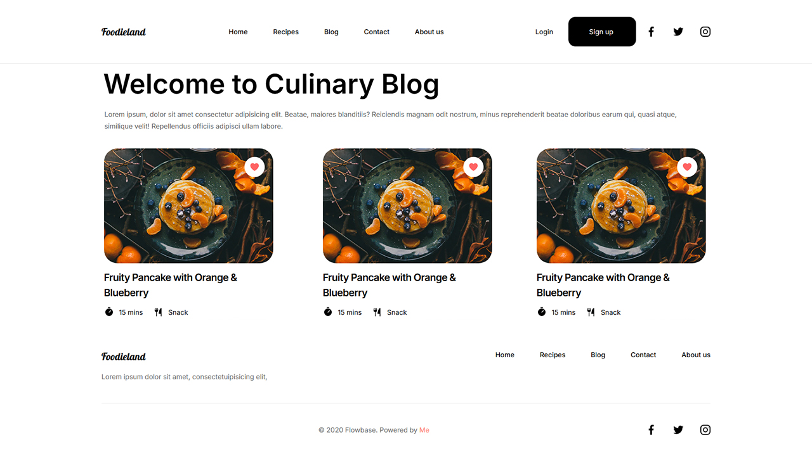
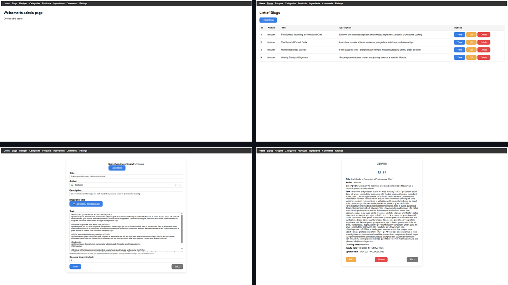

# 🍳 Cooking-Blog-Java

**Cooking Blog-Java** is a full-stack web application for cooking enthusiasts. Users can browse, create, and share recipes, write blog posts, leave comments, rate content.

The project is split into three independent applications:
- **Backend** — REST API built with Spring Boot.
- **Frontend** — User-facing web application.
- **Admin Panel** — Administrative interface for content management.

<!-- Screenshot of sites (temporary disabled) -->
<!-- 
# Frontend Screenshot

# Admin Panels Screenshot

-->


## 🔨 Quick Start (Running Locally)

1. **Clone the repository**
   ```bash
   git clone https://github.com/your-username/Cooking-Blog-Java.git
   cd Cooking-Blog-Java
   ```

2. **Backend** (`CB_Backend`)
   - Navigate: `cd CB_Backend`
   - Configure the database in `application.properties`
   - Run: `./mvnw spring-boot:run` (or via your IDE)
   - API available at `http://localhost:8080`

   Detailed instructions: [CB_Backend/README.md](CB_Backend/README.md)  
   JavaDoc: https://dimababich0.github.io/Cooking-Blog-Java/

3. **Frontend** (`frontend`)
   - `cd frontend`
   - Install dependencies: `npm install`
   - Start: `npm run dev`
   - Available at `http://localhost:5173` (or the port shown by Vite)

   Detailed instructions: [frontend/README.md](frontend/README.md)

4. **Admin Panel** (`cb_admin`)  
   Same as frontend:
   ```bash
   cd cb_admin
   npm install
   npm run dev
   ```
   Detailed instructions: [cb_admin/README.md](cb_admin/README.md)


## 🚀 Tech Stack

- **Backend**: Java 25, Spring Boot 3.5, Spring Data JPA, Spring Data JPA, Hibernate, Oracle Database
- **Frontend & Admin Panel**: React, Vite, Axios, React Router
- **Other**: File upload & storage


## ✨ Key Features

- User registration and authentication
- Full CRUD operations for recipes, blogs, comments, and ratings
- Image upload and storage
- Responsive admin panel for content moderation


## 📁 Repository Structure

```
├── CB_Backend/     # Backend (Spring Boot)
├── cb_admin/       # Admin panel (React + Vite)
├── docs/           # JavaDoc files
├── frontend/       # User-facing frontend (React + Vite)
└── screenshots/    # Images for the README.md
```


## ⚙️ [Backend](https://github.com/DimaBabich0/Cooking-Blog-Java/tree/main/CB_Backend)

- Built with **Java 25 + Spring Boot**  
- Uses **Spring Data JPA**, **Hibernate**, and **REST API**  
- Supports CRUD operations for recipes, blogs, comments, and ratings
- File upload and retrieval via `/api/files`  
- Global error handling for constraints and common exceptions  

> Detailed instructions for running the backend are available in [`CB_Backend/README.md`](CB_Backend/README.md).  
> JavaDoc: https://dimababich0.github.io/Cooking-Blog-Java/


## 🖥️ [Frontend](https://github.com/DimaBabich0/Cooking-Blog-Java/tree/main/frontend)

- Built with **React + Vite**  
- User-facing application to view, create, and interact with recipes and blogs  

> Detailed setup and running instructions are in [`frontend/README.md`](frontend/README.md).


## 🛠️ [Admin Page](https://github.com/DimaBabich0/Cooking-Blog-Java/tree/main/cb_admin)

- Built with **React + Vite**  
- Admin panel for managing backend

> Setup and running instructions are in [`cb_admin/README.md`](cb_admin/README.md).


## 👥 Authors

- Dima Babich [(@DimaBabich0)](https://github.com/DimaBabich0)
- Artem Borisenko [(@xeekes)](https://github.com/xeekes)
- Maksym Ganich [(@makaa4ak)](https://github.com/makaa4ak)


## 📌 License

This project is licensed under the MIT License. See the [LICENSE](LICENSE) file for details.


## 🤝 Contributing

Contributions are welcome! Please open an issue first for major changes.

Thank you for checking out the project! ⭐ If you like it, consider giving it a star!